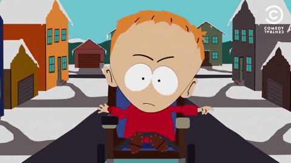

## Timmy Timmy avait 5 chats et 2 chiens. Un jour, une personne sonna à sa porte et lui demanda ceci :
### 'J'en ai marre d'entendre vos chiens aboyer chaque jour pendant des heures, c'est insupportable', dit-il d'un air désagréable.
### Timmy Timmy lui répondit ceci : 'Si vous faisiez moins de bruit derrière le mur, cela n'arriverait pas.'

### Son voisin lui dit : "Si je les entends encore, je vais bouffer tes chiens."
## À quoi Timmy Timmy lui répondit : "Ce sont mes chats qui vont te bouffer ! Tim Tim Timmy"
# Oh non, pas les chats, j'ai peur des chats.

# "Hmm, moi j'aime les chats", s'exclama le voisin d'en bas.
## Timmy Timmy, d'un air surpris, dit : "Mais que fais-tu dans ma cave ?"
### D'un ton aigri, il répondit : "Tu tu tu tu tu tu." Le réveil de Timmy sonna.

**Timmy Timmy** trembled as he heard the menacing growl of his neighbor's voice echoing in the hallway.

He whispered a silent prayer, hoping his furry friends would come to his rescue.
Suddenly, from the shadows emerged his loyal feline companions, their eyes gleaming with determination.
With a fierce yowl, they pounced on the intruder, defending their beloved owner with all their might.

*In that moment of chaos, Timmy Timmy realized the true power of love and loyalty, embodied by his faithful pets.*

